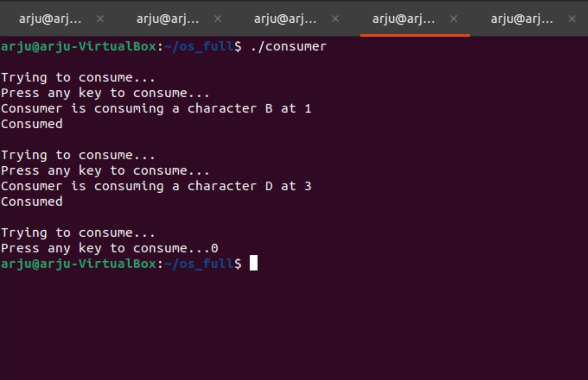

## Bounded-shared-memory-for-multiple-producers-and-consumers

This repository contains producer and consumer programs that can use shared memory with synchronization using semaphores to produce and consume information.

#### Introduction
The bounded-buffer problem is a classic example of concurrent access to a shared resource (or synchronization). A bounded buffer allows multiple producers and
multiple consumers share a single buffer. Producers write data to the buffer and consumers read data from the buffer.
A bounded buffer with capacity N has can store N data items. The places used to store the data items inside the bounded buffer are called slots. Without proper
synchronization the following errors may occur - 
- The producers don’t block when the buffer is full.
- A consumer consumes an empty slot in the buffer.
- A consumer attempts to consume a slot that is only half-filled by a producer.
- Two producers write into the same slot.
- Two consumers read the same slot.

#### Prerequisites - 
Knowledge of semaphores and shared memory in System V

#### Approach
I have used three semaphores for my approach that are S, empty and full.
1. The S semaphore provides mutual exclusion for access to the buffer.
    - Initialise to 1.
    - A producer or a consumer must wait on this semaphore before entering the critical section.
    - A producer or a consumer will signal this semaphore after leaving the critical section.
2. The empty semaphore is used to count the empty slots in the buffer.
    - Initialise to N.
    - A producer must wait on this semaphore before writing to the buffer.
    - A consumer will signal this semaphore after reading from the buffer.
3. The full semaphore is used to count the number of data items or full slots in the buffer.
    - Initialise to 0.
    - A consumer must wait on this semaphore before reading from the buffer.
    - A producer will signal this semaphore after writing to the buffer

## Output
We can create as many as possible producers and consumers processes. But, only one process can access the shared memory space at a time while other processes will wait for their turn.  
Here, I demonstrate with only two producers and two consumers.  
To stop a process, input 0 to exit when it gets access. (Incase, any process hangs, just exit using ctrl+z)

#### 1. Terminal 1

#### 2. Terminal 2

#### 3. Terminal 3

#### 4. Terminal 4

## Delete 
When we stop all the processes, the semaphore array and shared segment are not destroyed yet. We have to do that explicitly. For that, you have two choices:  
#### 1. Compile and run the del.c program output file, it will destroy both the objects. This file delete them through a call to semctl() and shmctl with the cmd set to IPC_RMID, assuming no one else is attached to it.

#### 2. Destroy the semaphores and shared memory segment from the command line using the *ipcrm* Unix command.

Also, be sure that you don't leave any unused shared memory segments sitting around wasting system resources. All the System V IPC objects you own can be viewed using the *ipcs* command.

